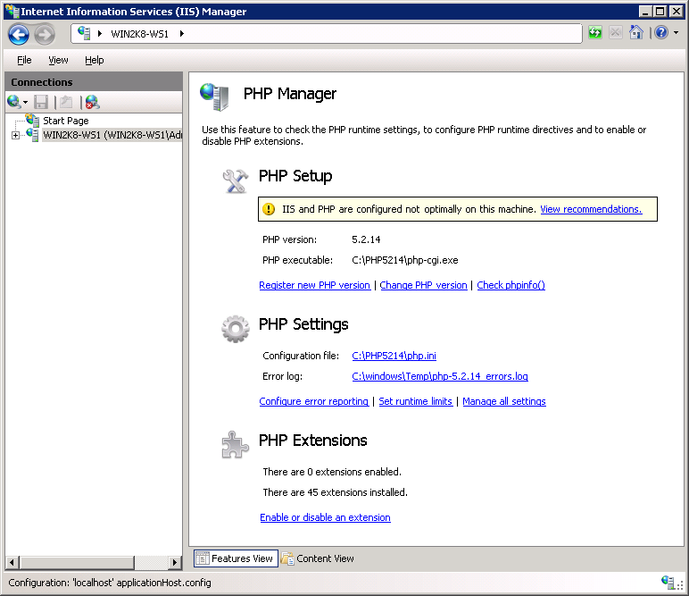

.. phpmanager documentation master file, created by
   sphinx-quickstart on Sat Dec 19 17:51:25 2015.
   You can adapt this file completely to your liking, but it should at least
   contain the root `toctree` directive.

.. _index:

PHP Manager 2 for IIS
=====================

.. caution::
   :doc:`PHP on IIS/Windows lost Microsoft support! </getting-started/supported-platforms>`

   PHP Manager 2 for IIS does not plan any new releases.

PHP Manager for IIS is a GUI for managing multiple PHP installations on the
IIS server.

Copyright (C) 2010-2013 Ruslan Yakushev

Copyright (C) 2018-2023 Lex Li, Alexandre Mutel, and other contributors

Use it to:

#. Register PHP with IIS;
#. Validate and properly configure existing PHP installations;
#. Run multiple PHP versions side by side on the same server and even within
   the same web site;
#. Check PHP runtime configuration and environment (output of ``phpinfo()``
   function)
#. Configure various PHP settings
#. Enable or disable PHP extensions
#. Remotely manage PHP configuration in ``php.ini`` file

PHP Manager main page:

PHP Manager - configuration recommendations:

.. image:: _static/config.png

Topics
------

.. toctree::
    :titlesonly:

    getting-started/index
    tutorials/index
    Support Services <https://support.lextudio.com>
    privacy
