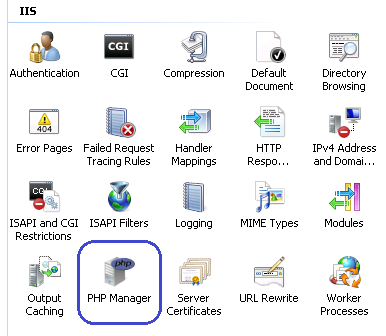
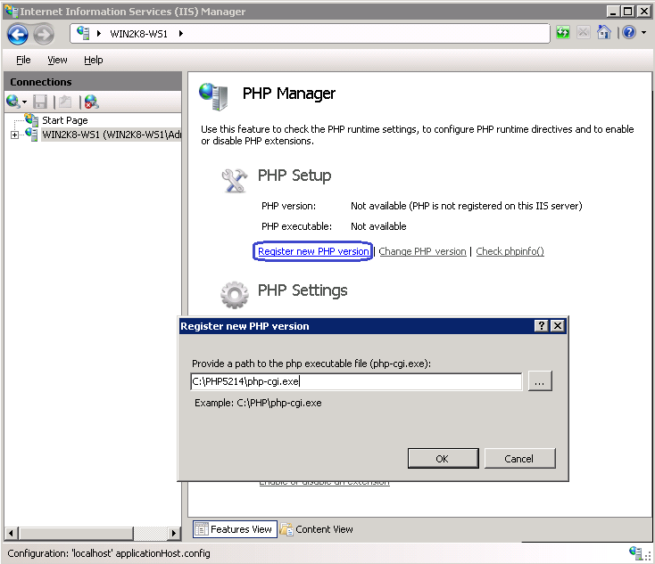
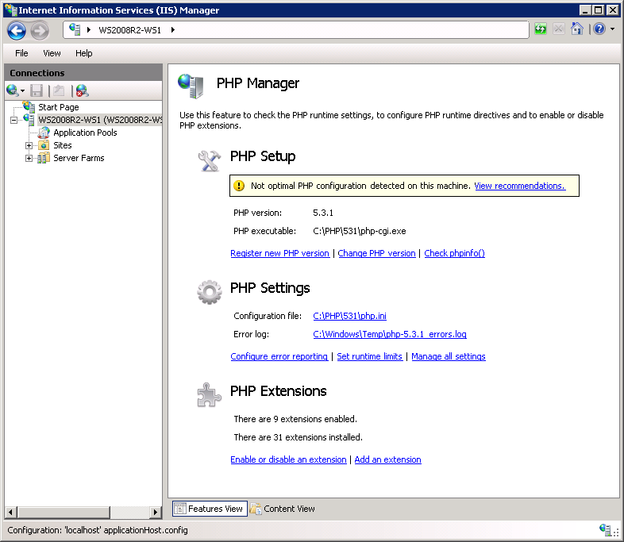
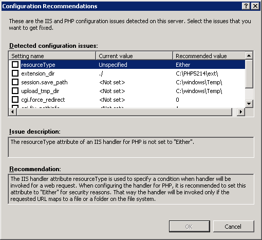
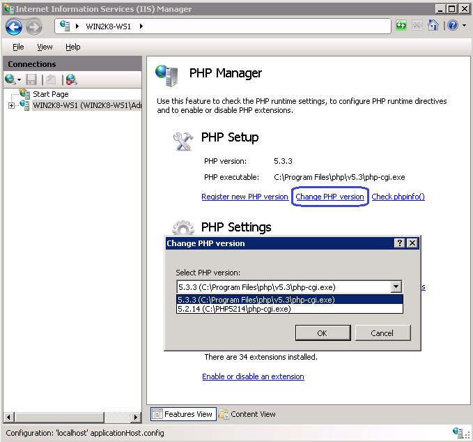
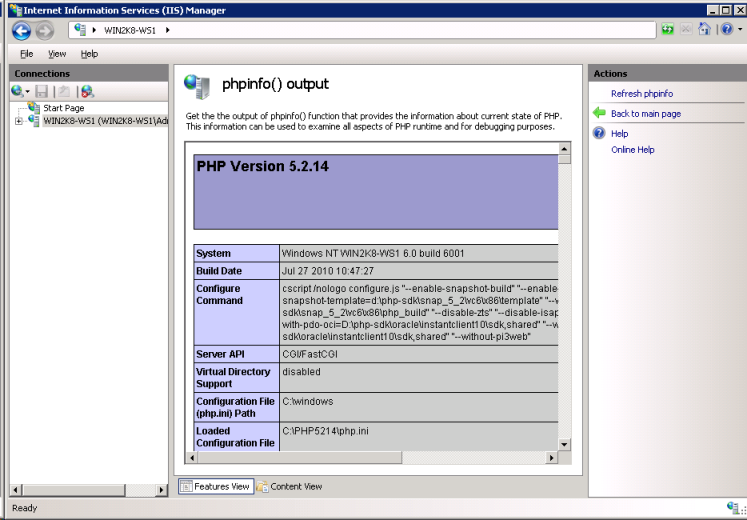
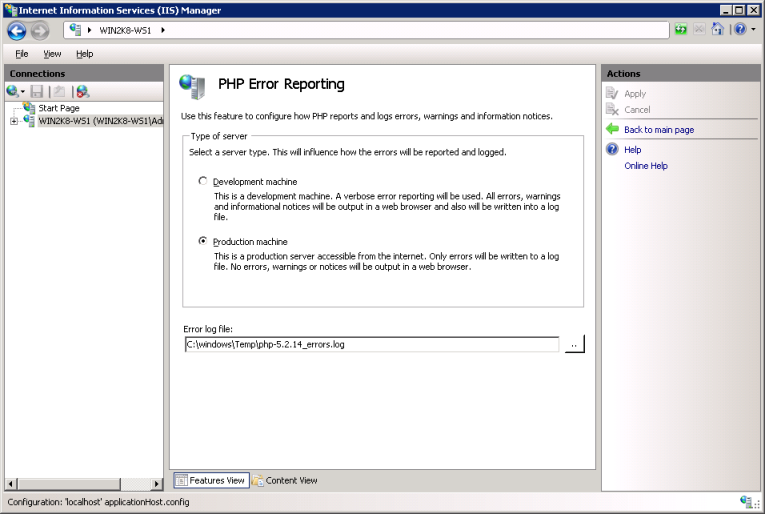
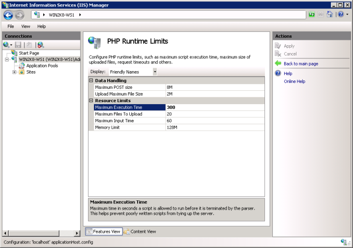
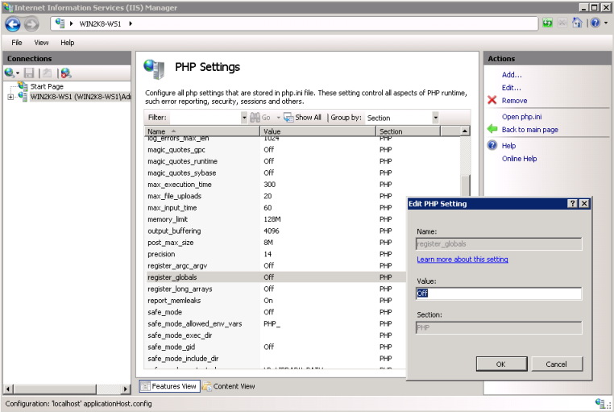
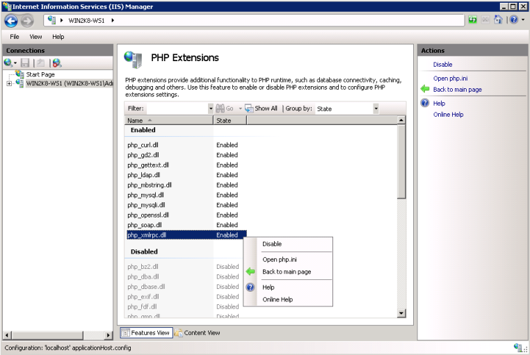

Managing PHP installations with PHP Manager user interface
==========================================================

By `Ruslan Yakushev`_, `Lex Li`_

This article describes how to use PHP Manager for IIS user interface.

Prerequisites
-------------
Make sure you install PHP Manager for IIS properly following
:doc:`/getting-started/installation` .

After installation is complete, launch the IIS Manager and find the "PHP
Manager" feature:

When opened, the "PHP Manager" feature provides a configuration overview for
the PHP installation that is registered with IIS and is currently active. If no
PHP is registered with IIS, then the only action that can be performed is the
registration of a new PHP version.

Registering PHP with IIS
------------------------
To register a new PHP version with IIS, first you need to download the zip
archive with PHP binaries from http://windows.php.net/ and then extract the
files from it into a folder of your choice.

.. note:: You can also install PHP by using Web Platform Installer or the
   Windows installer from http://windows.php.net/ - the PHP Manager can be used
   to manage those PHP installations as well.

Click on "Register new PHP version" task and then provide the full path to the
location of the main php executable file: php-cgi.exe:

After clicking OK the new PHP version will be registered with IIS and will
become active. This means that all the sites on this IIS server by default will
use this PHP version.

Validating existing PHP installations and fixing configuration issues
---------------------------------------------------------------------

In order for PHP to run properly on IIS there is a set of recommended settings
that need to be configured in IIS and PHP. PHP Manager checks if all of the
recommended settings are configured correctly. If some settings are not
configured properly then you can use PHP Manager to fix those settings.

When some configuration settings are configured incorrectly you will see a
warning message when you open PHP Manager:

After clicking on "View Recommendations" link you can see all the configuration
issues that exist in your PHP installation. You can review each issue
description and the recommended corrective action. You can also select which
configuration issues you want to be fixed:

Switching between PHP versions
------------------------------
After multiple PHP versions have been registered with IIS, you can use PHP
Manager to easily switch between the versions on a server, site and application
levels. This means that you can configure some IIS sites to use one PHP
version, while other sites use different version. Also, you can configure
separate applications within a web site to use different PHP versions.

.. note:: When switching the PHP versions on any level except server level, the
   PHP Manager will make a local copy of all IIS Handlers on that level. This
   means that if later you make any changes to handler mappings on an upper
   configuration level, that won't take effect on this configuration level. You
   can easily determine if the PHP handler is defined locally versus being
   inherited from an upper configuration level by checking the information on
   PHP Manager main feature page:

   .. image:: _static/inherited.png

Checking phpinfo() output
-------------------------
``phpinfo()`` function in PHP provides very detailed information about all
aspects of PHP runtime configuration. To check the ``phpinfo()`` output from
within PHP Manager use the "Check phpinfo()" task.

Configuring Error Reporting
---------------------------
You can use PHP Manager to configure error reporting level in PHP. If IIS is
used on a development machine then you may want to use verbose error reporting
in order to see all the errors, warnings and notices from your PHP application
right away. If IIS is used as a production server, then error reporting level
is less verbose and errors are logged in a log file, but never communicated to
HTTP client.

.. note:: ``track_errors`` option is obsolete in PHP 7.2 and above, so it is
   not included in recommended settings. More information can be found in
   `this article <http://php.net/manual/en/migration72.deprecated.php>`_ .

Configuring Runtime Limits
--------------------------
Various timeouts and limits can be configured in the "PHP Runtime Limits" page:

Configuring All PHP Settings
----------------------------
All existing PHP settings can be added, removed and modified in the "PHP
Settings" page.

Enabling or Disabling PHP Extensions
------------------------------------
PHP extensions can be enabled or disabled in the "PHP Extensions" page:

.. note:: ``php_sql.dll`` is obsolete in PHP 7.0 and above, so it is not
   included in recommended extension list. More information can be found in
   `this RFC document <https://wiki.php.net/rfc/remove_deprecated_functionality_in_php7>`_ .

Unregistering PHP with IIS
--------------------------
At server level, remove the PHP items registered in "FastCGI Settings" feature
in IIS Manager.

.. note:: To register PHP, please follow "Registering PHP with IIS" section.

Related Resources
-----------------

- :doc:`/getting-started/installation`
- :doc:`/tutorials/command-line`
